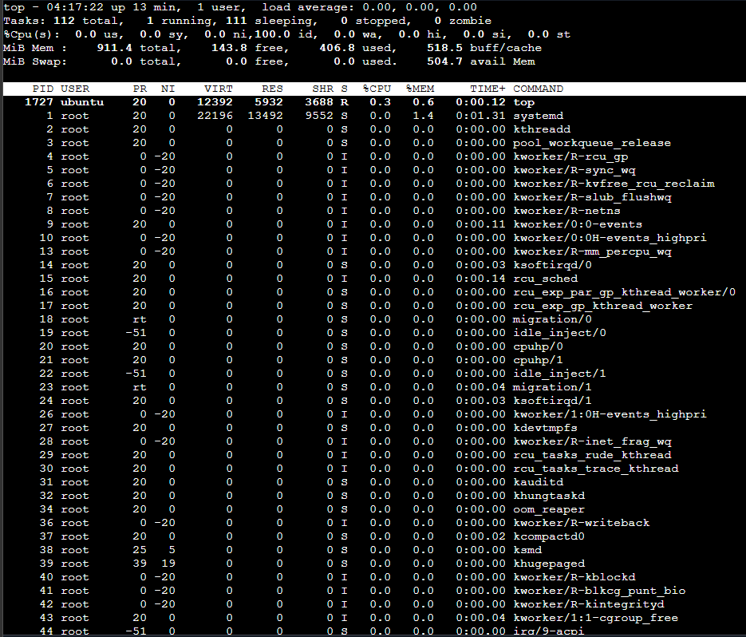
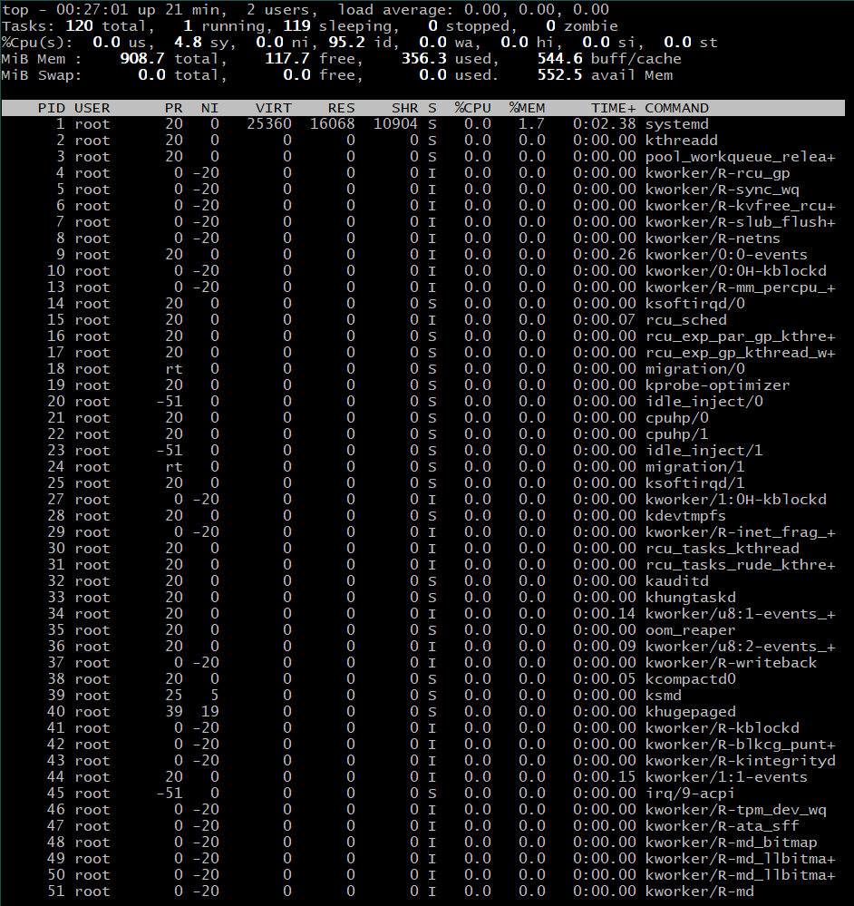
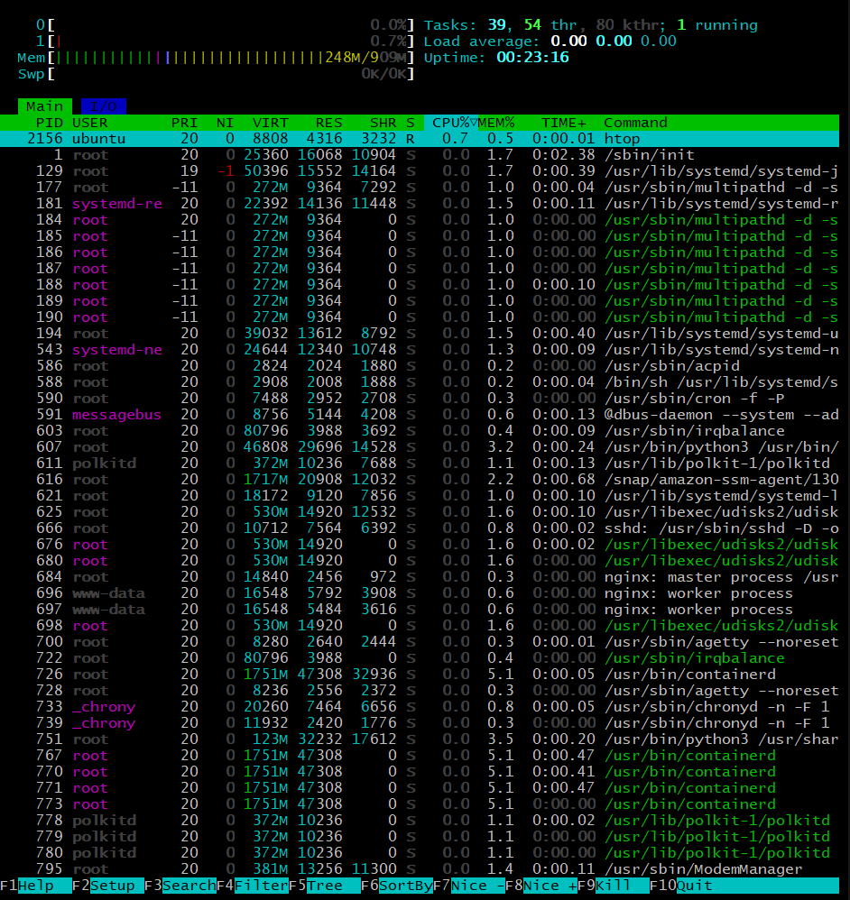
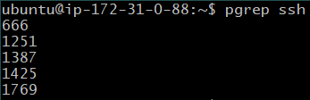
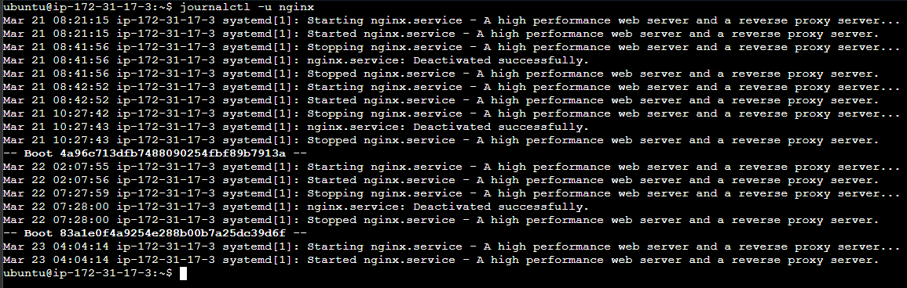
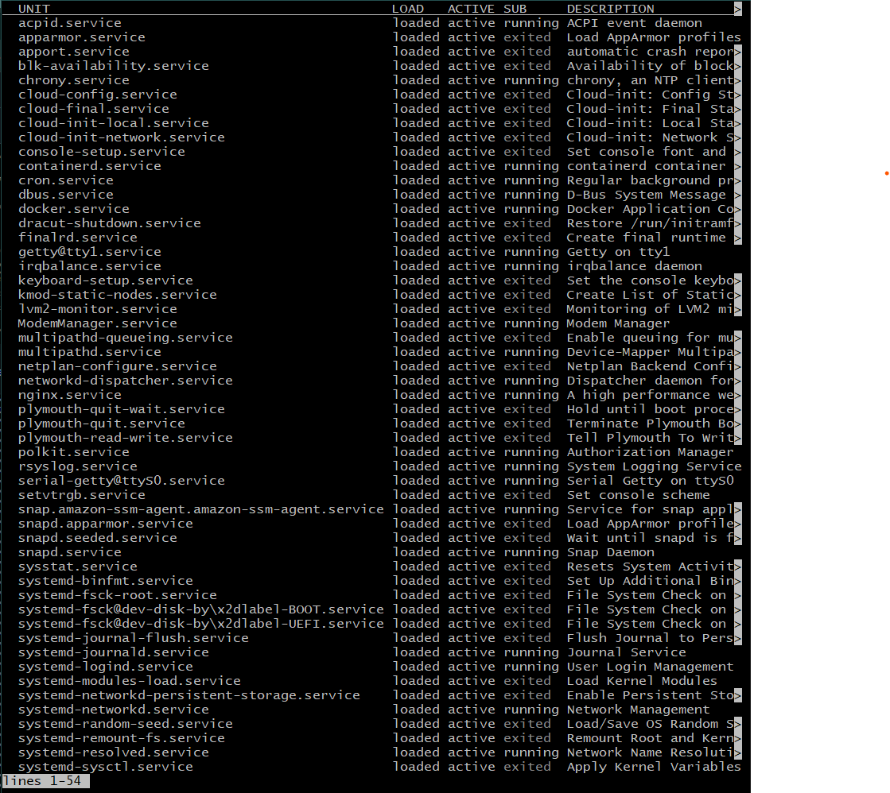
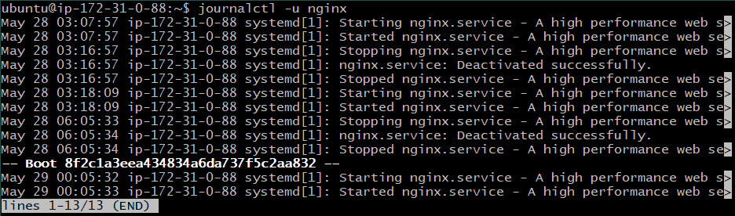
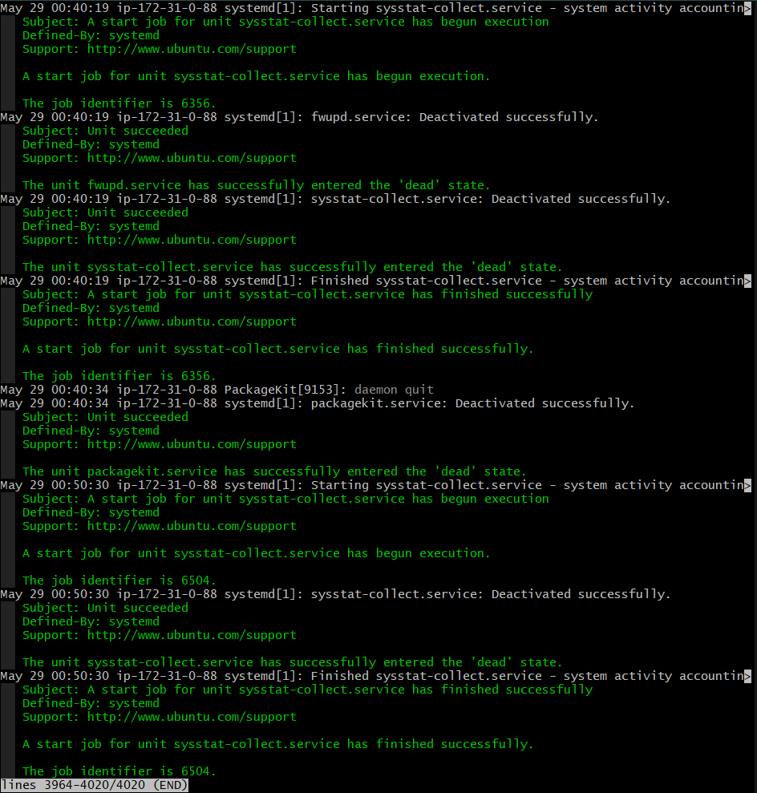
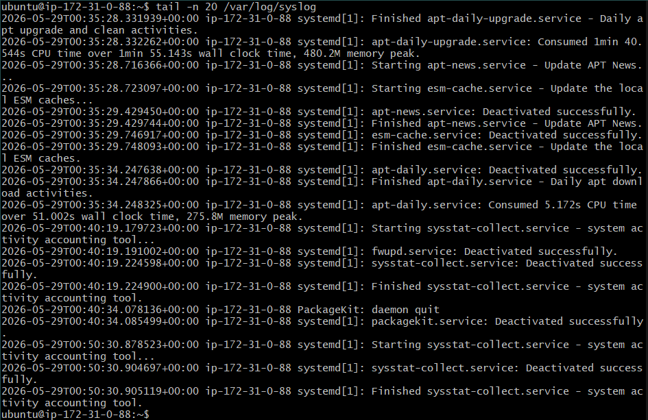

# Day 4 – Linux Practice: Processes and Services

> Services like ssh, nginx, docker, cron, ping

## ⚙️ Process checks
1. ```ps -ef``` → Provides snapshot of all running processes.


* ```ps -ef | grep ssh``` → Shows SSH-related running processes.




2. ```top``` → Provides dynamic real-time view of all the running processes.



* ```htop``` → Same as top with additional features like  interactive process viewer; we can scroll horizontally & vertically.




3. ```pgrep <service>``` → Find PID of a process.



---

## 🔧 Service checks
1. ```systemctl status ssh``` → Check service status/health; service is active and running.




2. ```systemctl list-units --type=service``` → Display all active/running services



> “Linux services are managed by systemd using systemctl commands.”

---

## 📄 Log checks
1. ```journalctl -u nginx``` → View nginx logs.



* ```journalctl -xe``` → Recent errors.




2. ```tail -n 20 /var/log/syslog``` → Shows last 20 lines of system log file.



---

## 🛠️ Mini troubleshooting steps
1. Check service statsus 
```systemctl status <service>```

2. Check logs
```journalctl -u <service>```

3. Restart service if required or service is down
```sudo systemctl restart <service>```

4. Verify process
```systemctl status <service>``` or ```pgrep <serviceName>```

### 🧠 Memory Tip
Status → Logs → Restart → Verify

---

## 📌 Commands to Rmember (Must-Know)
```ps -ef```
```htop```
```pgrep```
```systemctl status```
```systemctl list-units --type=service```
```journalctl -u```
```tail -n```