# 📘 Linux Troubleshooting Runbook 

Runbook is a short, repeatable checklist which we follow during an incident.

---

## 🛠️ Target service / process
**nginx**

---

### 🔍 Environment basics / System info
1. ```uname -a```: Print all system information || Ubuntu with kernel 6.17.0-1007-aws (optimized for aws environment). No issue observed.

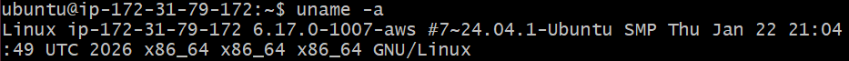


2. ```lsb_release -a```: Linux standard base, gives formatted OS information. OS is Ubuntu 24.04 LTS, stable version.

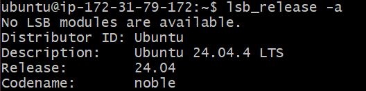


3. ```cat /etc/os-release```: Actual source file with detailed OS information used in scripts/automation ⚙️. OS is Ubuntu 24.04 LTS.

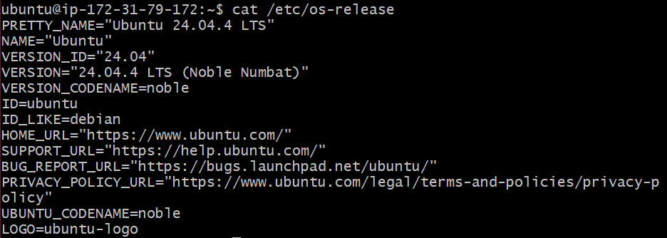

---

### 📁 Filesystem sanity
1. ```mkdir /tmp/runbook-demo```
    ```cp /etc/hosts /tmp/runbook-demo/hosts-copy && ls -l /tmp/runbook-demo```  
Observation: Directory and file created successfully. Later, we check for file permission which looks correct.

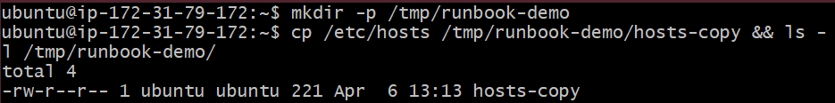

---

### ⚙️ CPU / Memory check
1. ```htop```: It gives dynamic real-time view of running processes. Similar to top, but allow us to scroll vertically & horizontally, and interact using a mouse.

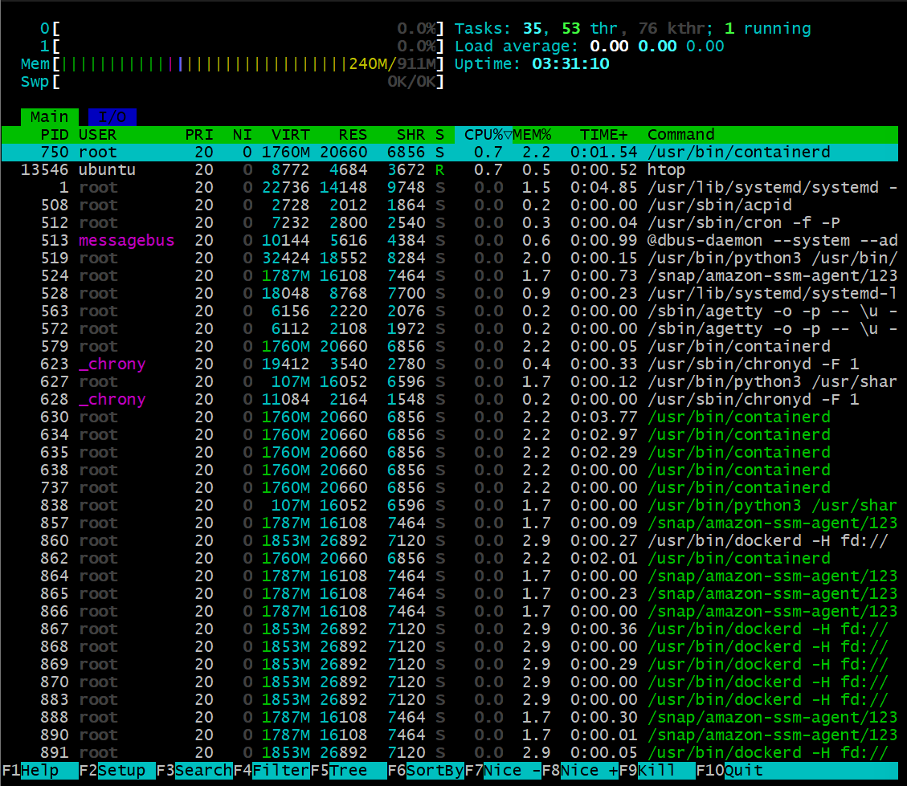


2. ```ps -o pid,pcpu,pmem,comm -p $(pgrep nginx)```: Finds all nginx processes and show their CPU and Memory usage. Nginx is using low CPU and Memory.
    * First finds all nginx PIDs and passes result to the ```ps -o pid,pcpu,pmem,comm -p```
    * pid => Process ID
    * pcpu => CPU utilization %
    * pmem => Memory utilization %
    * comm => command name (e.g., Nginx)

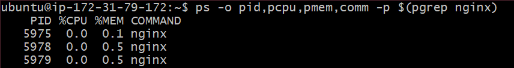


3. ```free -h```: Observed enough free memory (~497MB available) and system is not under high memory utilization.

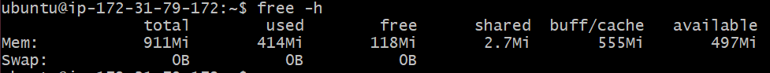

---

### 💾 Disk / IO check
1. ```df -h```: Disk utilziation is healthy (~69% free disk on root), no storage issue.

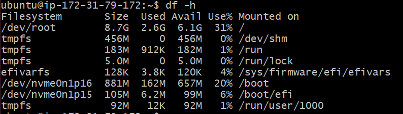


2. ```du -sh /var/log```: Log dir size is normal, no log buildup issue.

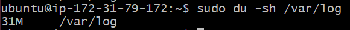


3. ```iostat/vmstat/dstat```: ~99% CPU idle, so no load. No heavy disk activity. No network traffic. No swapping hence good and sufficient RAM available. No performance issue. Overally system is idle, stable and healthy.

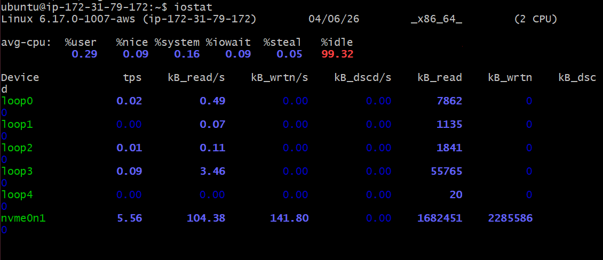

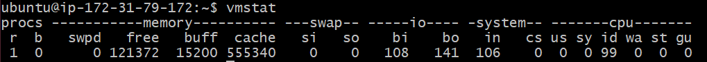

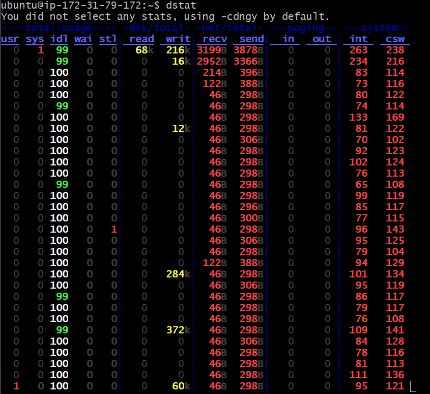

---

### 🌐 Network
1. ```sudo ss -tulpn | grep nginx```: Nginx is listening on port 80 (HTTP)

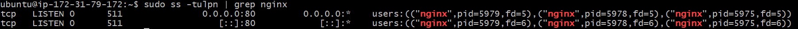


2. ```sudo netstat -tulnp | grep nginx```: Nginx is listening on port 80 (HTTP)

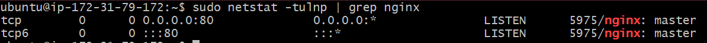

⚠️**NOTE:** ss and netstat command is used for the same purpose. ss is fast, modern and recommended while netstat is slower and legacy.


3. ```curl -I http://localhost```: Service is responding correctly.

 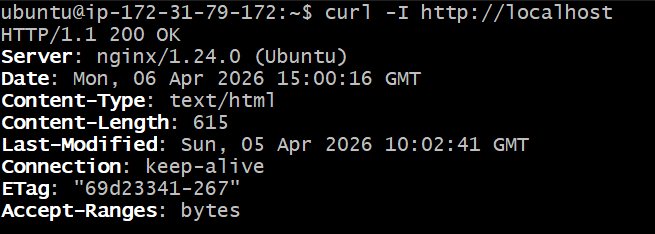

---

### 📜 Logs 
1. ```journalctl -u nginx -n 50```: Multiple times nginx was restarted but without any failure/errors.

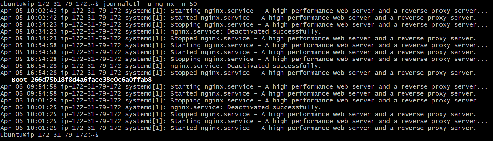


2. ```tail -n 30 /var/log/syslog```: System logs looks normal but there is AWS SSM permission error(IAM role not configured proeprly).

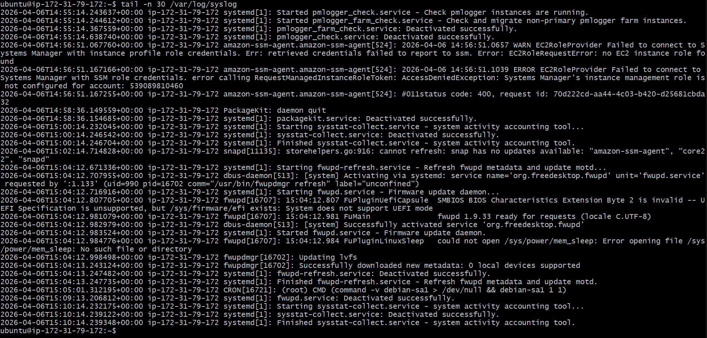

---

### 🤓 Quick finding
+ System is stable.
+ CPU and Memory usage is normal.
+ Disk space is sufficient.
+ Network is fine.
+ Nginx is running.
+ No such errors found.


### 🚨 If This Worsens
1. Restart service
```sudo systemctl restart nginx```


2. Check error logs
```tail -n 50 /var/log/nginx/error.log```

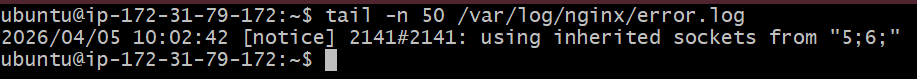


3. strace (Deep debugging)
```pgrep nginx```
```sudo strace -p <pid>```

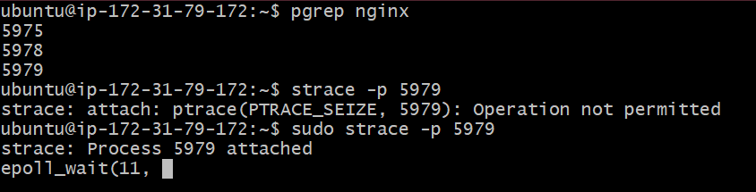